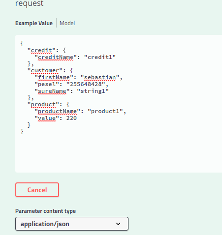
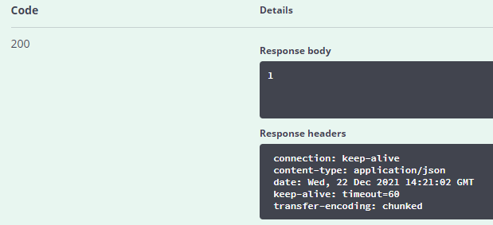
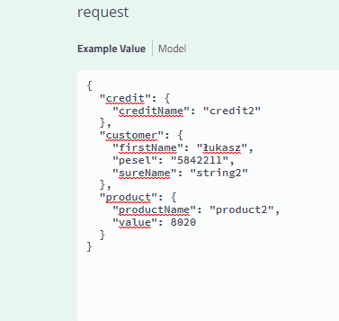
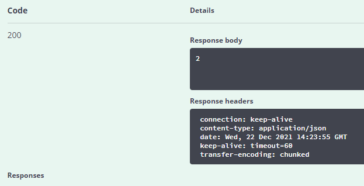
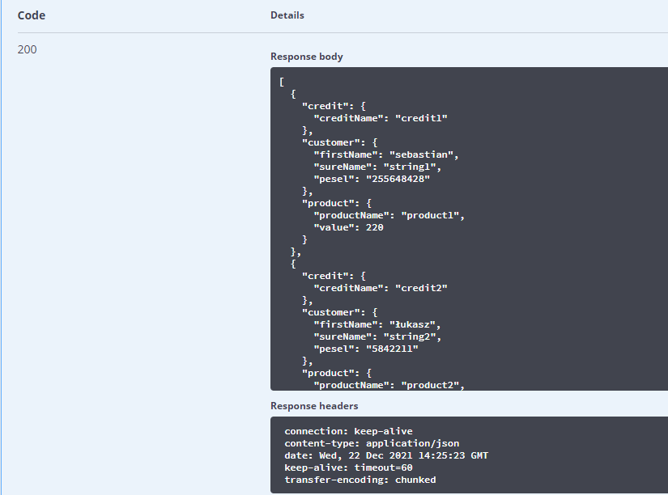

# **Credit-Services**

Aby zainstalować ten przykład, uruchom następujące polecenia:
```bash
mvn clean install

docker-compose up -d
```
Usługi rest są dostępne pod adresami:

[http://localhost:8081/createCredit](http://localhost:8081/getCredits)

[http://localhost:8081/getCredits](http://localhost:8081/getCredits)

Lub używając swaggera:

[localhost:8081/swagger-ui.html]()

## **Przykładowe wywołania usług**

##### CreateCredit






##### GetCredits

